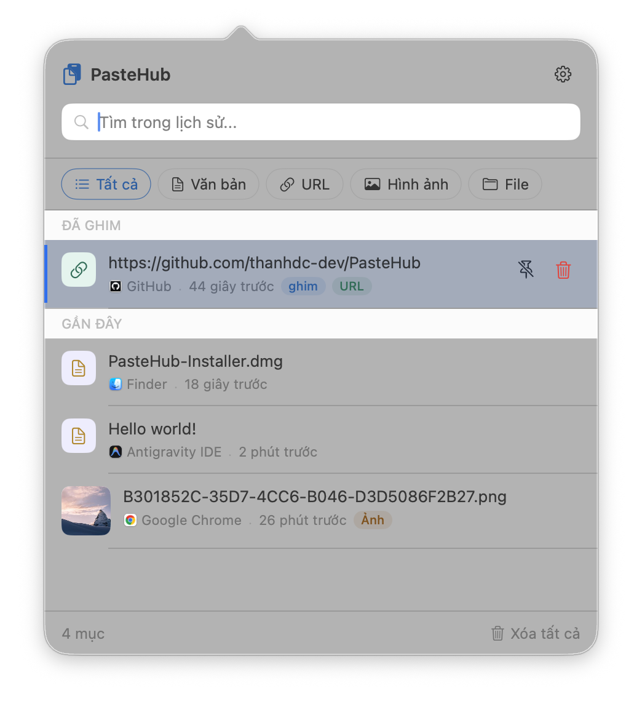
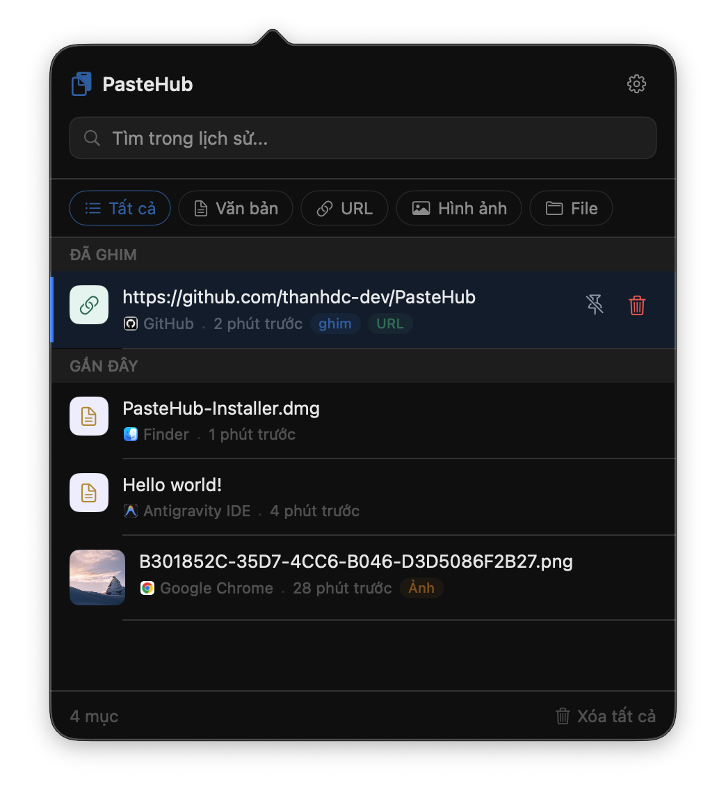
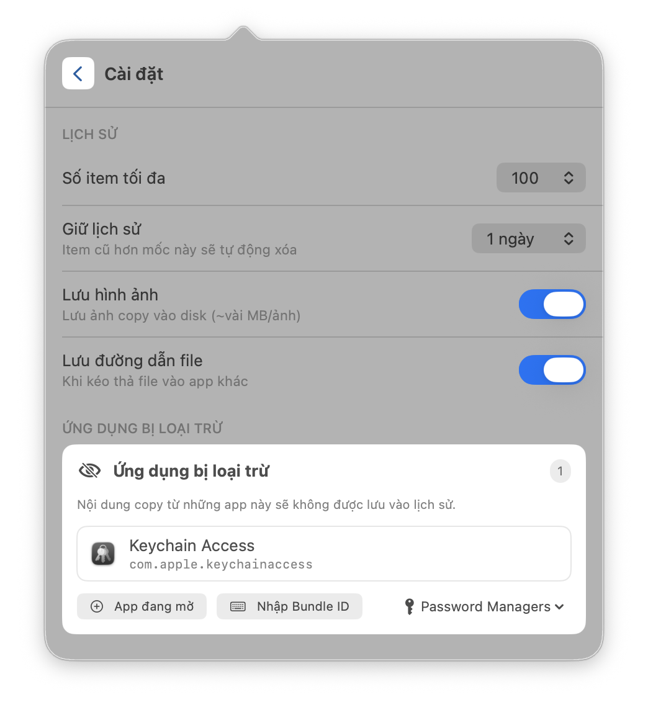
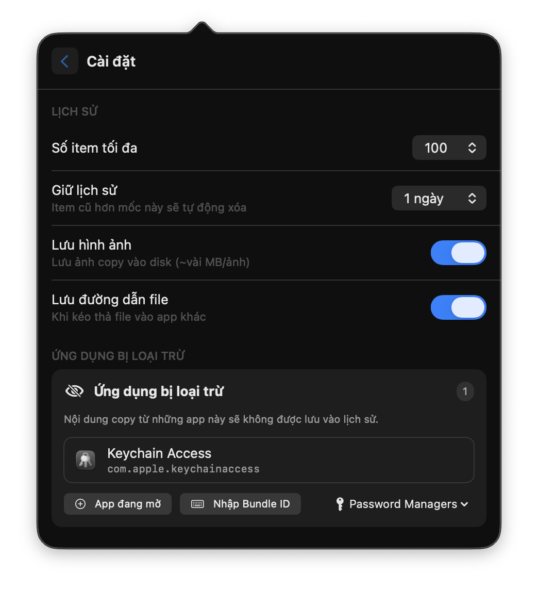

# PasteHub

[🇬🇧 English Version](README_EN.md)

Một ứng dụng menubar macOS nhẹ, chạy trực tiếp trên hệ điều hành, giúp bạn dễ dàng truy cập và quản lý lịch sử clipboard. Được phát triển bằng SwiftUI, SQLite (GRDB), và Sparkle.

---

## 📸 Ảnh chụp màn hình

### Giao diện chính

  
  &nbsp;
  

### Cấu hình

  
  &nbsp;
  

## ✨ Tính năng nổi bật

- ⚡ **Tự động lưu Clipboard** — Tự động lưu lại văn bản, liên kết (URL), hình ảnh (PNG), và đường dẫn tệp tin khi bạn thực hiện sao chép.
- 🔍 **Tìm kiếm nhanh** — Tìm kiếm tức thì trong lịch sử với SQLite-backed full-text search
- 📌 **Ghim mục yêu thích** — Giữ các mục thường dùng luôn ở đầu danh sách để tránh bị xóa khi dọn dẹp lịch sử.
- 🎨 **Giao diện macOS thuần bản địa** — Thiết kế tối giản, hỗ trợ chế độ Sáng và Tối (Light/Dark mode).
- 🔒 **Riêng tư & Ngoại tuyến** — Toàn bộ dữ liệu được lưu trữ cục bộ tại thư mục `~/Library/Application Support/PasteHub`, hoàn toàn không đồng bộ cloud.
- 🔄 **Tự động cập nhật** — Cập nhật phiên bản mới tự động và an toàn trong nền nhờ Sparkle framework.
- 🧹 **Tự dọn dẹp** — Tự động xóa bỏ các mục cũ, không ghim sau một số ngày thiết lập (mặc định: lưu trữ vĩnh viễn).
- 🚫 **Bỏ qua ứng dụng** — Ngăn PasteHub ghi nhận thông tin sao chép từ các ứng dụng nhạy cảm chỉ định (như trình quản lý mật khẩu).
- ⌨️ **Phím tắt toàn cầu** — Nhấn tổ hợp phím mặc định `⌘⌥V` ở bất kỳ đâu để bật/tắt nhanh popover lịch sử clipboard.
- 🚀 **Tự động dán (Tùy chọn)** — Tự động thực hiện lệnh dán (`⌘V`) vào ứng dụng đang hoạt động ngay sau khi bạn chọn một mục.

---

## 🚀 Cài đặt & Thiết lập

1. **Tải về**: Tải xuống phiên bản mới nhất tại trang [Releases](https://github.com/thanhdc-dev/PasteHub/releases).
2. **Cài đặt**: Nhấn đúp chuột để mở trình cài đặt. Sau đó kéo ứng dụng `PasteHub.app` vào thư mục `/Applications` (Ứng dụng).
3. **Khởi chạy**: Nhấp đúp chuột để mở ứng dụng.

> [!IMPORTANT]
> **Cảnh báo ứng dụng macOS chưa ký số (Unsigned App):**
> Vì PasteHub là dự án mã nguồn mở và miễn phí, nó không được ký bằng tài khoản Apple Developer trả phí. macOS sẽ chặn ứng dụng trong lần đầu khởi chạy.
>
> Để khắc phục và mở ứng dụng bình thường, vui lòng xem [Hướng dẫn xử lý lỗi Gatekeeper](docs/INSTALLATION.md).

---

## 📖 Hướng dẫn sử dụng nhanh

1. Nhấn tổ hợp phím **`⌘⌥V`** để ẩn/hiển thị popover lịch sử clipboard.
2. Sử dụng các phím mũi tên **`↑` / `↓`** để di chuyển giữa các mục.
3. Nhấn **`Space`** (Phím cách) để xem trước nhanh nội dung (QuickLook) đối với hình ảnh và văn bản.
4. Nhấn **`Enter`** (hoặc nhấp chuột) để sao chép mục được chọn trở lại clipboard. Nếu bạn bật tính năng **Tự động dán (Auto Paste)** trong phần Cấu hình, ứng dụng sẽ tự động dán nội dung vào ứng dụng đang làm việc.
5. Nhấn **`Delete`** để xóa mục được chọn ra khỏi lịch sử.
6. Nhấn **`Esc`** để xóa bộ lọc tìm kiếm đang nhập hoặc đóng popover.

---

<b>⚙️ Cấu hình & Thiết lập ứng dụng</b>

### Tùy chỉnh PasteHub

Bạn có thể truy cập Cấu hình bằng cách nhấp vào biểu tượng bánh răng ở góc trên popover lịch sử:

| Cấu hình                                      | Mô tả                                                                       | Mặc định         |
| :-------------------------------------------- | :-------------------------------------------------------------------------- | :--------------- |
| **Retention** (Thời hạn lưu)                  | Số ngày lưu trữ các mục chưa được ghim (0 = lưu vĩnh viễn)                  | `0`              |
| **Save images** (Lưu hình ảnh)                | Bật/Tắt ghi nhận các hình ảnh được sao chép                                 | `Bật` (Enabled)  |
| **Save file paths** (Lưu đường dẫn tệp)       | Bật/Tắt ghi nhận đường dẫn tệp tin được sao chép                            | `Tắt` (Disabled) |
| **Launch at login** (Khởi chạy cùng hệ thống) | Tự động mở PasteHub khi đăng nhập macOS (qua `SMAppService`)                | `Tắt` (Disabled) |
| **Auto Paste** (Tự động dán)                  | Giả lập tổ hợp `⌘V` ngay sau khi chọn mục (yêu cầu cấp quyền Accessibility) | `Tắt` (Disabled) |
| **Excluded apps** (Ứng dụng loại trừ)         | Quản lý bundle ID và tên viết tắt để bỏ qua khi theo dõi clipboard          | `-`              |

<b>⌨️ Bảng tra cứu phím tắt nhanh</b>

### Danh sách phím tắt

| Phím tắt      | Hành động                                                 |
| :------------ | :-------------------------------------------------------- |
| **`⌘⌥V`**     | Ẩn/Hiện popover lịch sử clipboard                         |
| **`⌘ ,`**     | Mở bảng Cấu hình                                          |
| **`↑` / `↓`** | Di chuyển lên/xuống trong danh sách lịch sử               |
| **`Enter`**   | Sao chép mục chọn và tự động dán (nếu tính năng được bật) |
| **`Space`**   | Mở khung xem trước nhanh (QuickLook)                      |
| **`Delete`**  | Xóa mục được chọn ra khỏi lịch sử                         |
| **`Esc`**     | Xóa từ khóa tìm kiếm đang gõ hoặc đóng popover            |
| **`⌘Q`**      | Thoát hoàn toàn ứng dụng PasteHub                         |

---

## 🛠️ Kiến trúc & Phát triển

PasteHub được viết bằng Swift, framework SwiftUI và tuân thủ mô hình kiến trúc MVVM.

Nếu bạn là lập trình viên muốn tìm hiểu sâu hơn về luồng dữ liệu, cấu trúc thư mục dự án và các thư viện phụ thuộc, vui lòng tham khảo [Tài liệu Kiến trúc (bản tiếng Anh)](docs/ARCHITECTURE.md).

## 🔒 Riêng tư & Bảo mật

Quyền riêng tư của bạn là tuyệt đối. Toàn bộ lịch sử clipboard được lưu trữ **100% cục bộ** trên thiết bị của bạn. Ứng dụng không chứa mã theo dõi, không thu thập dữ liệu hành vi (telemetry), và không bao giờ kết nối đám mây.

Để gỡ bỏ hoàn toàn ứng dụng cùng toàn bộ dữ liệu clipboard đã lưu, hãy kéo ứng dụng vào Thùng rác (Trash) và tiến hành xóa thư mục:
`~/Library/Application Support/PasteHub`
