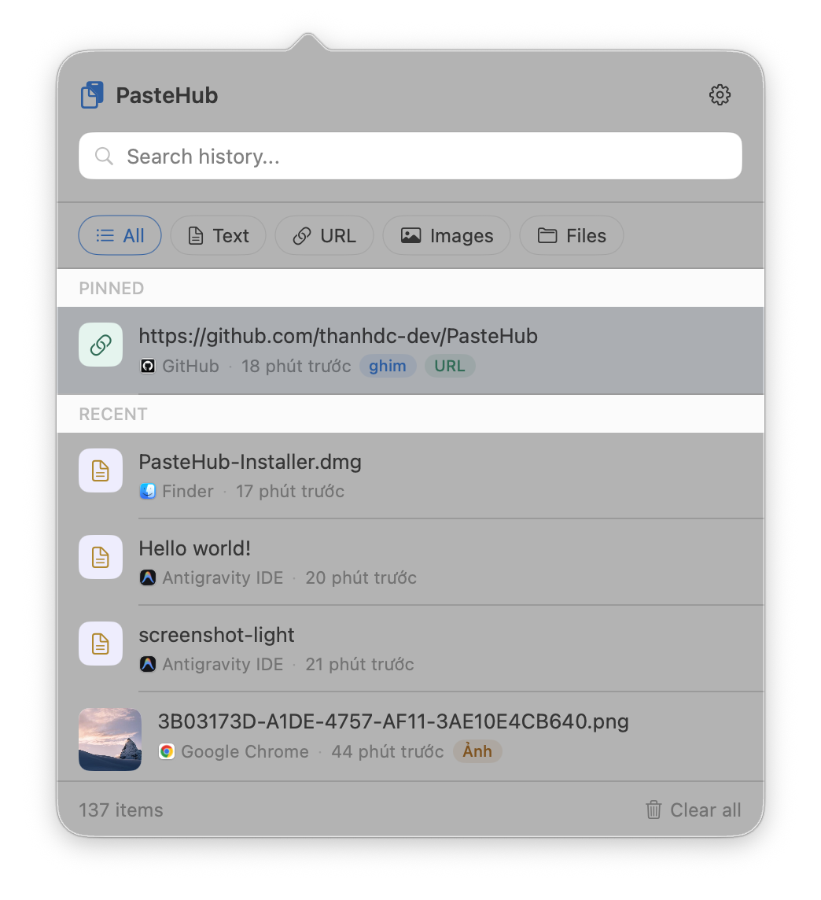
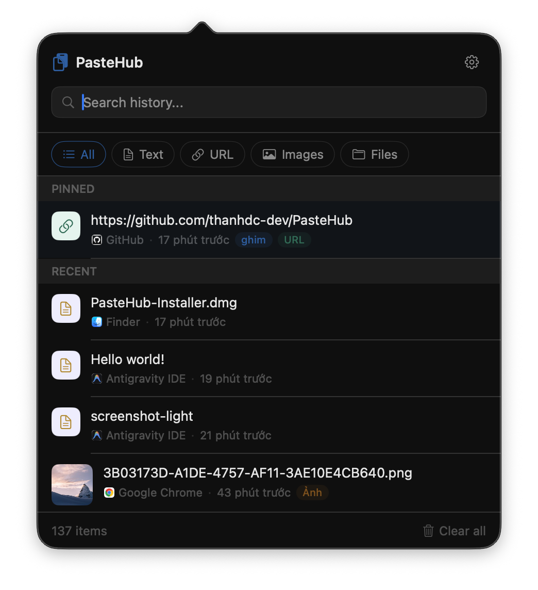
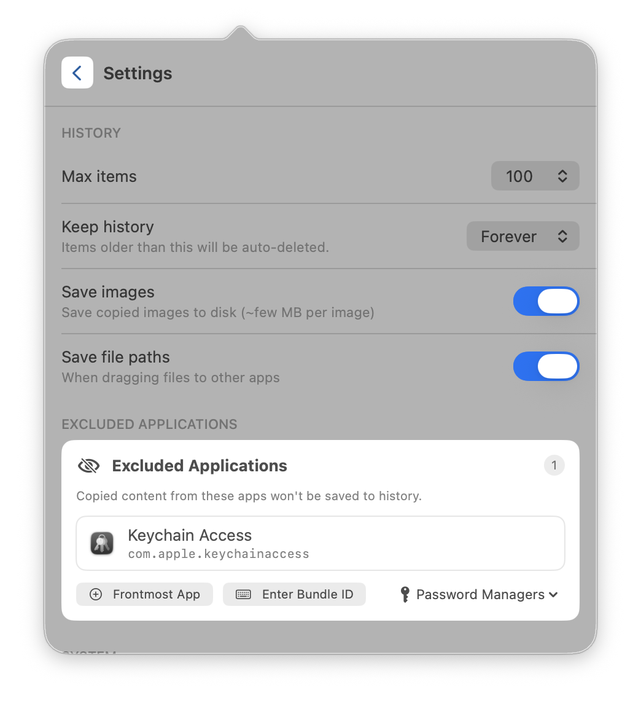
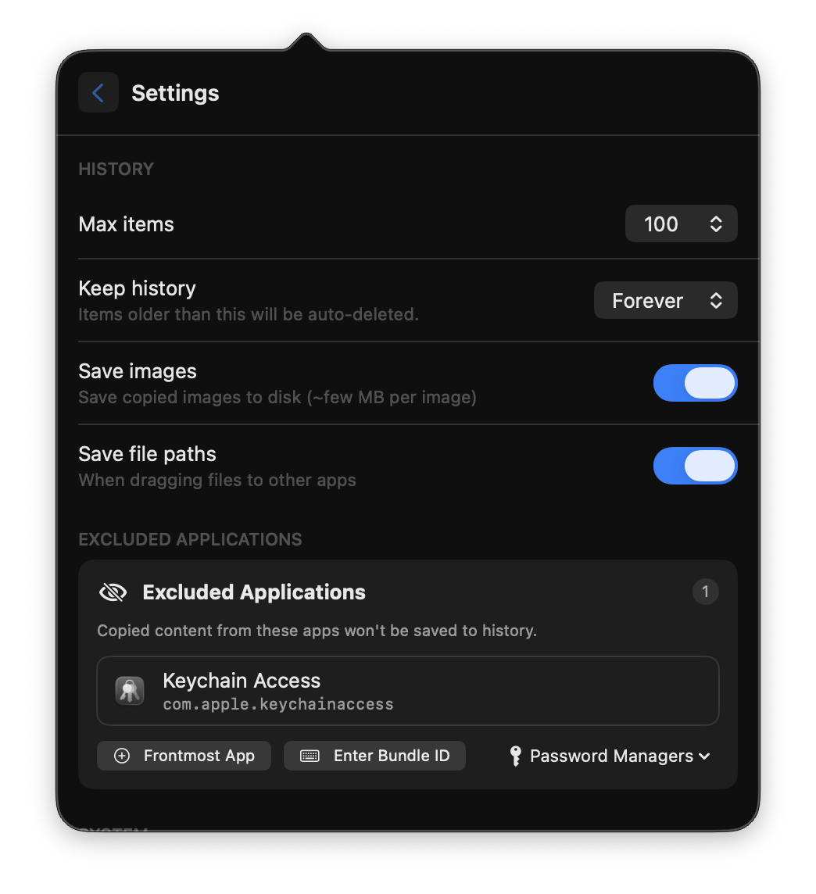

# PasteHub

[🇻🇳 Bản tiếng Việt](README.md)

A lightweight, native macOS menu bar application that keeps your clipboard history at your fingertips. Built with SwiftUI, SQLite (GRDB), and Sparkle.

---

## 📸 Screenshots

### Main interface

  
  &nbsp;
  

### Settings

  
  &nbsp;
  

## ✨ Features

- ⚡ **Auto-save Clipboard** — Automatically saves copied text, URLs, images (PNG), and file paths.
- 🔍 **Quick Search** — Instantly search your history with SQLite-backed full-text search.
- 📌 **Pin Favorites** — Keep frequently used items pinned at the top so they survive history clearing.
- 🎨 **Native macOS UI** — Clean design with full support for light and dark modes.
- 🔒 **Private & Offline** — All data is stored locally in `~/Library/Application Support/PasteHub`, with zero cloud sync.
- 🔄 **Auto-Updates** — Seamless background updates powered by the Sparkle framework.
- 🧹 **Auto-Clear** — Automatically trim old, unpinned clipboard items after a customizable retention period.
- 🚫 **Exclude Apps** — Prevent PasteHub from saving copied data from specific applications (e.g., password managers).
- ⌨️ **Global Shortcut** — Press `⌘⌥V` from anywhere to toggle the clipboard history popover.
- 🚀 **Auto-Paste (Opt-in)** — Optionally paste items automatically into the active app immediately after selection.

---

## 🚀 Installation & Setup

1. **Download**: Get the latest version from the [Releases](https://github.com/) page.
2. **Install**: Drag `PasteHub.app` to your `/Applications` folder.
3. **Run**: Double-click to open.

> [!IMPORTANT]
> **macOS Unsigned App Warning:** 
> Because PasteHub is free and open-source, it is not signed with a paid Apple Developer certificate. macOS will block it on first launch.
> 
> To bypass this warning safely, see the [Gatekeeper Troubleshooting Guide](docs/INSTALLATION_EN.md).

---

## 📖 How to Use

1. Press **`⌘⌥V`** to open/close the clipboard history popover.
2. Navigate items using the **`↑` / `↓`** arrow keys.
3. Press **`Space`** to show a native QuickLook preview (for text and images).
4. Press **`Enter`** (or click) to copy the item back to the clipboard. If **Auto Paste** is enabled in Settings, the item is pasted directly into your active app.
5. Press **`Delete`** to remove a specific item from history.
6. Press **`Esc`** to clear the active search query or close the popover.

---

<b>⚙️ Settings & Configuration</b>

### Customizing PasteHub

Settings can be accessed by clicking the gear icon in the popover header:

| Setting | Description | Default |
| :--- | :--- | :--- |
| **Retention** | Number of days to keep unpinned items (0 = forever) | `0` |
| **Save images** | Toggle whether copied images are stored | `Enabled` |
| **Save file paths** | Toggle whether file URLs are stored | `Disabled` |
| **Launch at login** | Start PasteHub automatically on login (via `SMAppService`) | `Disabled` |
| **Auto Paste** | Automatically simulate `⌘V` after selecting an item (requires Accessibility permission) | `Disabled` |
| **Excluded apps** | Manage bundle IDs and short names to ignore (pre-seeded with password managers) | `-` |

<b>⌨️ Keyboard Shortcuts Reference</b>

### Shortcuts Table

| Shortcut | Action |
| :--- | :--- |
| **`⌘⌥V`** | Toggle clipboard history popover |
| **`⌘ ,`** | Open settings |
| **`↑` / `↓`** | Navigate list items |
| **`Enter`** | Copy selected item to clipboard (and auto-paste if enabled) |
| **`Space`** | Open QuickLook preview |
| **`Delete`** | Remove selected item from history |
| **`Esc`** | Clear active search or close popover |
| **`⌘Q`** | Quit PasteHub |

---

## 🛠️ Architecture & Development

PasteHub is built using Swift, SwiftUI, and the MVVM architecture pattern. 

For developers interested in the codebase layout, data flow diagrams, and dependencies, please read the [Architecture Guide](docs/ARCHITECTURE.md).

## 🔒 Privacy

Your privacy is a priority. All clipboard data remains **100% local** on your device. The app has no tracking, no telemetry, and no cloud components. 

To uninstall and completely delete all stored data, drag the app to the Trash and delete the following directory:
`~/Library/Application Support/PasteHub`
